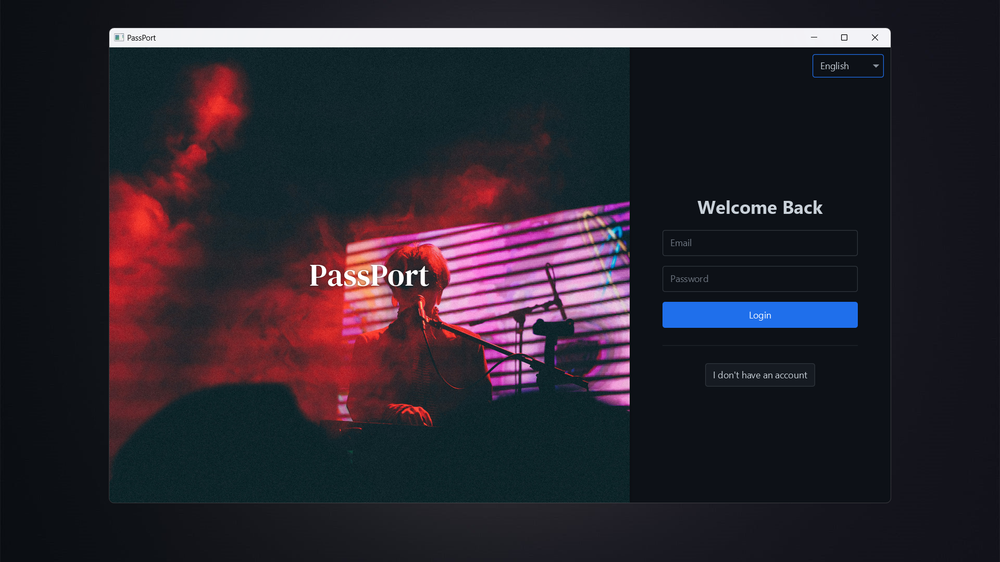
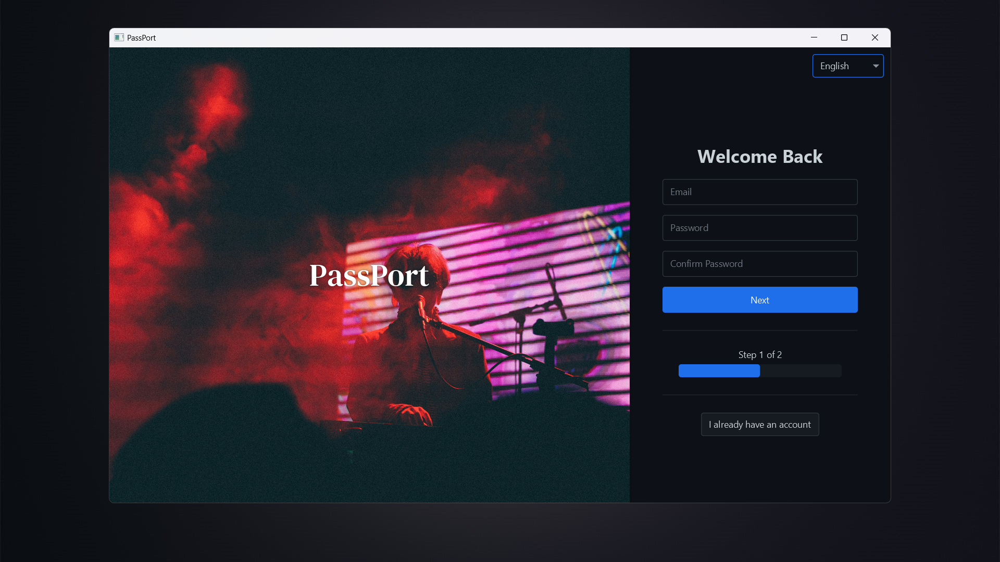
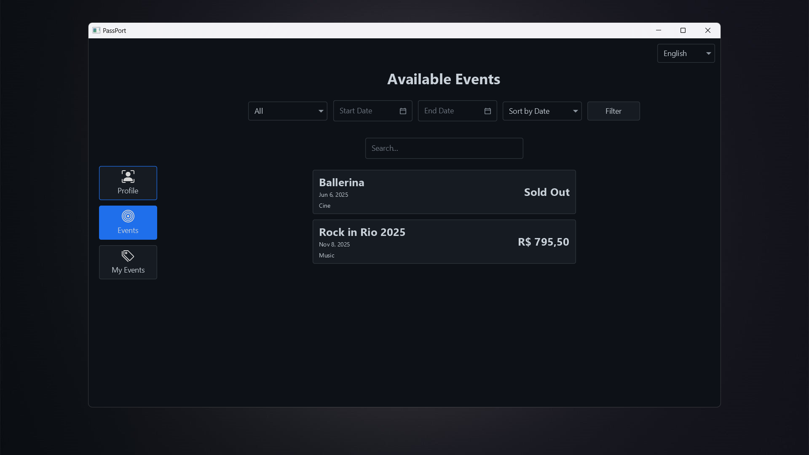
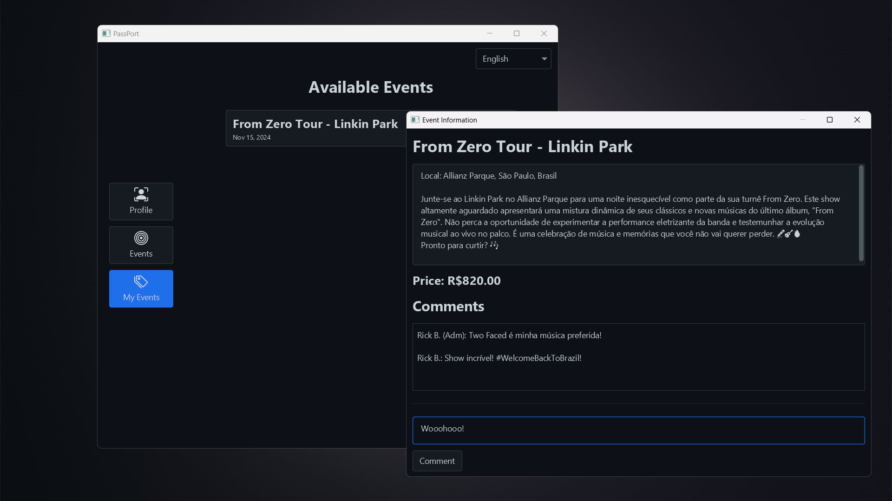
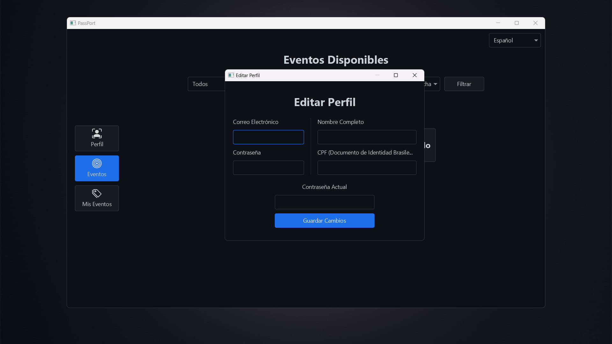

# Events Management

This project is a PBL (Project-Based Learning) initiative for my university's Programming and Algorithms II course. 
It focuses on applying OOP principles in Java through practical, real-world scenarios.

The requirements are:
- Must be written in Java
- Must follow some project requirements
- Must not use database, but store data into Json files

## Features

- **Event Creation:** Administrators can create new events.
- **User Management:** The system manages administrators and regular users.
- **Ticket Sales:** Includes a ticketing system where users can buy tickets for events.
- **Event Listings:** Users can browse through a list of available events.
- **Event Evaluation:** After attending events, users can evaluate them.
- **Refund Management:** The project also supports ticket refunds.
- **Database Integration:** All the event and user data is stored in a Json database.

### UI Features
- **General**
  - Input validation: using REGEX
  - Translations: English, Spanish, Portuguese and Japanese
  - Accessibility Features: by using SetAccessibleText 
    and Github's CSS from AtlantaFX
  - Three modes of initialization:
    - **Hot run (default)**: Runs with the stored database.
    - **Cold run**: Runs with a new database.
    - **Dry run**: Runs with a new virtual database. 
      Won't save changings.
- **Welcome Window**
  - Allow registration
  - Allow login
- **Events Window**
  - List Available Events
  - Filter Events by name, date or category
  - Open Events Details
  - Allow purchasing tickets for events
    - Via PIX or Credit Card
- **My Events Window**
  - List User's owned Tickets
  - Allow commenting owned Events
- **My Profile Window**
  - Updates the User Information


## ScreenShots







## Project's Structure

This project uses Clean Architecture and Domain-Driven Design (DDD) for learning purposes. 
The choosen Architecture ensures modularity and testability by separating the code into layers. 
With this in mind, the project's structure aligns perfectly with this approach. 
Here's a look at the `src/java/main/passport` structure:

- `application`: The Application logic and UI. 
    Responsible for deal directly with the final user.
    - `desktop`: The Desktop Application code, using JavaFX as GUI Framework.
- `domain`: The business logic
    - `context`: Provides all context needed for the user's stories
    - `exceptions`: Contains all domain-specific exceptions
    - `models`: Includes all models (entities and value objects)
- `infra`: The infrastructure code
    Handles database interactions and external services
- `roles`: All interfaces that define the logic
    Ensures flexibility between the infra and domain layers

## Workspace's Structure

The workspace contains three main folders:
- `docs`: the documentation generated from Javadocs 
- `src/java/main`: the source code
- `src/java/test`: the test files

## Documentation (The 2nd version)

* [Online Page](https://rickbarretto.github.io/passport)
* [Online API Documentation](https://rickbarretto.github.io/PassPort/docs/apidocs/)
* [Local Documentation](./docs/apidocs/)

## Java Version

```
java 22.0.2 2024-07-16
Java(TM) SE Runtime Environment (build 22.0.2+9-70)
Java HotSpot(TM) 64-Bit Server VM (build 22.0.2+9-70, mixed mode, sharing)
```

### Dependencies

```
JavaFX SDK 23
Maven 3.9.9
Gson 2.11.0
JUnit 5.11.3
AtlantaFX 2.0.1
```

## Used VsCode Extensions

### Extension Pack for Java
* Id: vscjava.vscode-java-pack
* Description: Popular extensions for Java development that provides Java IntelliSense, debugging, testing, Maven/Gradle support, project management and more
* Version: 0.29.2024091906
* Publisher: Microsoft
* VS Marketplace Link: https://marketplace.visualstudio.com/items?itemName=vscjava.vscode-java-pack

### GitHub Theme
* Id: GitHub.github-vscode-theme
* Description: GitHub theme for VS Code
* Version: 6.3.5
* Publisher: GitHub
* VS Marketplace Link: https://marketplace.visualstudio.com/items?itemName=GitHub.github-vscode-theme

---

Having this PBL being finished, I hope I never touch this language again in my life, in special JavaFX.
For my mental sanity, I'm out, peace! ✨